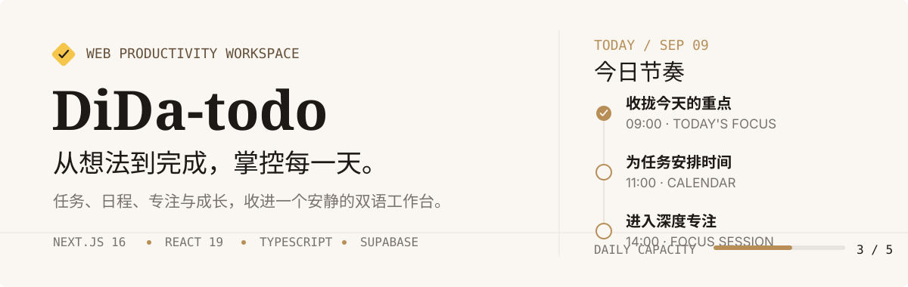
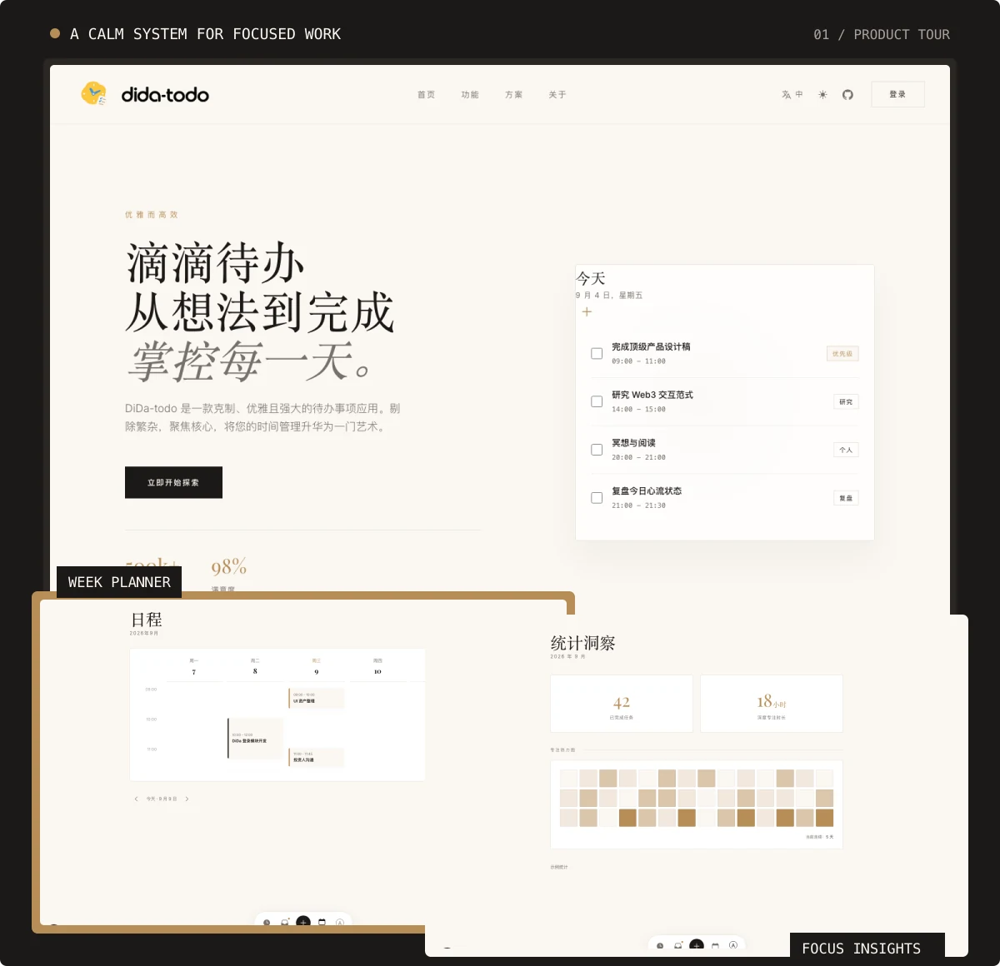
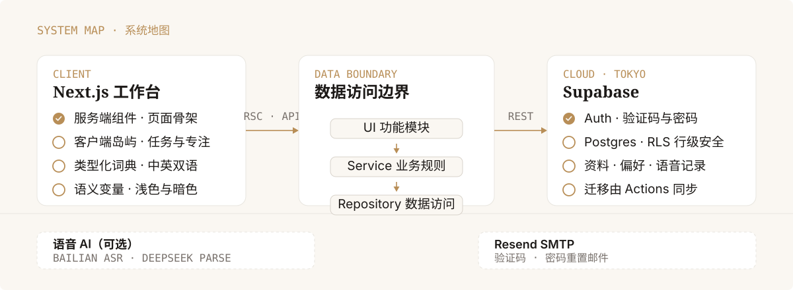

<p align="center">
  
</p>

<p align="center">
  一个以任务为核心，串联日程、专注与成长反馈的双语 Web 工作台。
  <br>
  <sub>邮箱认证 · 云端任务同步 · AI 当日整理 · 专注计时 · 站内提醒</sub>
</p>

<p align="center">
  <a href="#快速开始">快速开始</a> ·
  <a href="#核心体验">核心体验</a> ·
  <a href="#项目结构">项目结构</a> ·
  <a href="./docs/Development.md">开发约定</a>
</p>

## 先看产品

<p align="center">
  
</p>

登录后，可以在同一套安静、紧凑的视觉语言中完成任务收集、时间安排、AI 整理、深度专注与进度回顾。界面支持简体中文与 English，也支持浅色、暗色和跟随系统外观。

今日页的 One Thing 是重点摘要与专注入口，锁定是承诺标记，两者都不会将任务移出时间轴或「随时」列表；不再提供独立「今日必做」区域。同一任务在重点卡片与列表中的操作同步，容量只计一次。

> [!IMPORTANT]
> 工作区仅对已登录用户开放，不再提供游客直达或个人页面演示模式。任务、账户资料、工作台偏好、通知、语音确认记录和专注记录保存到 Supabase，并通过数据库 RLS 隔离。首页宣传指标与部分装饰性文案为展示内容，不代表实际用户统计或实时 AI 生成结果。

## 核心体验

| 工作流     | 可以体验什么                                   | 入口                                 |
| ---------- | ---------------------------------------------- | ------------------------------------ |
| 规划今天   | 今日重点、容量提示、承诺标记与时间轴           | `/today`                             |
| 收集与整理 | 随手记录、按日查看、清单与标签、AI 当日整理    | `/inbox`                             |
| 安排时间   | 日历选日、日期切换、任务时间编辑，无独立日程页 | `/inbox`、任务详情                   |
| 保持专注   | 可暂停、继续与退出的番茄钟，保存实际专注时长   | 今日页与任务详情                     |
| 回顾成长   | 已完成任务、专注热力图、等级与花园             | `/completed`、`/insight`、`/profile` |
| 管理账户   | 修改昵称与头像、重置密码、换绑邮箱、退出登录   | `/settings`                          |
| 接收提醒   | 任务到期通知、全部已读、确认后清空             | 工作区底部 Dock 的通知入口           |

- 沿用收件箱「记一笔」与 `/` 快捷键手动录入，支持明确的自然语言日期/时间及预览，默认今天，明确日期覆盖默认；Dock 提供语音入口。`⌘K / Ctrl+K` 搜索任务。不额外设置右上角快速添加入口。
- 在任务详情中编辑标题、描述、日期、优先级、清单、标签、预估、提醒与子任务。
- 无日期的未完成任务统一显示在收件箱「未安排」区域，选定日期后进入对应日程，不会自动变成今天。
- 任务创建、编辑、完成／恢复与删除会同步到云端；语言和主题偏好通过 Cookie 跨刷新保留。
- 键盘焦点、Esc 关闭、弹层焦点约束和减少动态效果均有对应处理。

### AI 当日整理

收件箱中的 AI 整理以**当前日历选中的日期**为边界，默认是今天。只整理这一天尚未完成的任务，不扫描整个收件箱，也不修改其他日期或已完成任务。

- **时间**：保留已设置的时间；未设置时，仅从标题或描述中提取明确的具体时刻，否则保持「随时」，不自动编排日程。
- **清单**：按内容选择现有的工作、学习或生活清单，不创建新清单或独立清单页面。
- **标签**：生成或复用 1–3 个相关短标签。
- **优先级**：建议 P1／P2／P3，不把所有任务都判为紧急。
- **预估**：根据当前番茄钟时长估算工作量，以 1–16 个番茄钟表示。

结果先显示在简约的「AI 整理」弹窗中，点击每条待办右侧的编辑图标，右侧会打开与详情页共用的表单，可在其中调整标题、描述、时间、清单、标签、优先级、预估、重复、提醒、锁定和子任务，日期保持不变，并能恢复原建议。编辑抽屉确认只更新本次草稿；点击「应用」只保存最终勾选的草稿，取消不会修改任务。超过 40 项时按每批最多 40 项依次请求，全部成功后显示结果；每批消耗接口配额。应用前检查本地与云端状态，已编辑、改期、完成或删除的任务会跳过，并报告应用、跳过与失败数量。

整理草稿复用完整任务详情表单，日期显示但不能改期。One Thing、删除及开始专注是即时操作，整理中显示但禁用，请先应用后在普通详情执行。重复设置遵循数据库迁移能力开关；子任务使用普通详情的同步流程，跨表保存不是单一事务，失败时应复查已保存内容。

### 重复与批量录入

任务详情支持每日、每周和 1–365 天间隔重复；完成时生成唯一后继，继承内容和提醒、重置子任务，不继承重点和锁定。下一日期沿原间隔推进到未来；需要数据库迁移 `0007`，未部署时重复设置禁用。收件箱按日期浏览，不提供清单、标签或状态筛选下拉菜单。

文字智能解析与语音多事项共用可编辑确认列表。可调整标题、日期、时间与清单，取消未提交草稿不保存；失败项保留原 ID 重试。全局无日期录入进入「未安排」，不会强制变成今天。

### 专注记录保存

计时到零立即保存，再进入休息或等待操作。短休息 5 分钟，每 4 轮长休息 15 分钟，可自动休息及在本次计时内选择自动下一轮；休息不计专注。每轮唯一 ID，暂停不计时，退出保留已发生时长。当前标签页刷新恢复计时状态；待上传记录按账号暂存并在回访时重试。浏览器存储不可用或清空、关闭标签页时，不保证倒计时恢复；不支持跨设备恢复活动计时。

### 通知生命周期

站内提醒在页面打开期间每 60 秒扫描一次；回访时，会补扫提醒时间已过但不足 24 小时的未完成任务。通知声音跟随全局音效偏好。

- 通知**不会自动过期**；点击通知打开任务时标记已读，「全部已读」只消除未读标记。
- 「清空通知」需要二次确认，隐藏现有已读与未读通知，不删除待办。
- 清空状态保存到云端，同时保留任务的已提醒记录，避免刷新或补扫时重新弹出同一条旧提醒。
- 删除任务时，其对应通知随之删除。
- 当前是一任务至多一条到期通知，不是按每次改期重新生成的提醒系统；不申请系统通知权限，也不在关闭页面后后台推送。

## 快速开始

需要 Node.js `24.x` 与 pnpm `11.22.0`。

```bash
git clone https://github.com/Yohoia/DiDa-todo.git
cd DiDa-todo
pnpm install --frozen-lockfile
cp .env.example .env.local
```

启动前，完成下面的 Supabase 环境变量、数据库迁移和邮件认证配置。`.env.example` 中的示例变量默认被注释，填写时需取消对应行的 `#`。不要提交 `.env.local`。

配置完成后运行：

```bash
pnpm dev
```

打开 <http://localhost:3000>，通过首页注册／登录进入工作区。未登录直接访问 `/today`、`/inbox`、`/completed`、`/insight`、`/profile` 或 `/settings` 时，会返回首页并打开登录框。

### 账号（Supabase）

应用运行与账号认证依赖两个环境变量：

- `NEXT_PUBLIC_SUPABASE_URL`：Supabase 项目 URL。
- `NEXT_PUBLIC_SUPABASE_ANON_KEY`：匿名公钥（配合数据库 RLS 行级安全使用）。

先按顺序应用 [supabase/migrations/](./supabase/migrations) 中的迁移（目前为 `0001`–`0009`）。`0006` 包含通知归属与清空标记，`0007` 新增重复任务与事务去重，`0008` 启用工作台 Realtime，`0009` 新增服务端任务搜索。目标 Supabase 已由 GitHub Actions 部署这些迁移；真实双设备、断网重连与大数据量搜索验收仍待执行。数据库部署约定见 [Supabase 说明](./supabase/README.md)。

注册流程为邮箱 + 密码 + 邮箱六位验证码（OTP），验证通过后设置密码并登录；昵称默认为邮箱前缀或随机名称，头像自动生成，之后可在设置中修改。登录支持密码与验证码两种方式，密码重置使用邮箱验证码验证；邮箱换绑需按确认邮件完成验证，实际验证范围取决于 Supabase Auth 配置。

邮件由 Supabase Auth 发送，无需向应用配置邮件服务密钥。请在 Supabase Dashboard 配置 SMTP（可使用 Resend），按 [邮件模板](./docs/email-templates) 设置对应模板，并配置 Site URL 与允许的 `/auth/callback` 回跳地址，覆盖本地开发和实际部署域名。

页面代理、工作区页面与服务端数据入口会验证会话；个人档案 API 与付费 AI／语音接口也独立要求登录。工作区监听会话变更，在退出登录、会话失效或切换账户时离开当前工作区。

设置页修改密码统一经过邮箱验证码验证，`recovery` 网址参数不能跳过此流程。直接调用云端 Auth API 的规则仍由 Supabase 配置控制；上线前核对 [密码安全策略](https://supabase.com/docs/guides/auth/password-security)，不要把客户端流程当作服务器强制二次验证。

### AI 配置（可选）

AI 当日整理默认复用语音待办的 LLM 配置，优先使用 `DEEPSEEK_API_KEY`，没有时回退到 `DASHSCOPE_API_KEY`。也可独立配置：

```dotenv
TASK_ORGANIZE_LLM_BASE_URL=https://api.deepseek.com/v1
TASK_ORGANIZE_LLM_API_KEY=your-server-side-key
TASK_ORGANIZE_LLM_MODEL=deepseek-flash
```

如需统一覆盖整理与语音解析，可设置 `VOICE_LLM_BASE_URL`、`VOICE_LLM_API_KEY`、`VOICE_LLM_MODEL`。接口地址、模型和 Key 应匹配实际供应商配置。所有 AI Key 都只用于服务端，不要加 `NEXT_PUBLIC_` 前缀。

未配置 AI Key 时，手动管理任务仍可使用；点击 AI 整理会提示服务未配置。整理会将所选任务的标题、描述与整理字段发送给配置的 LLM 服务，请按部署环境的数据要求选择供应商。

### 语音待办（可选）

底部导航的麦克风把整条导航栏变形为听写胶囊：录音 → 云端转写 → LLM 解析 → 确认卡一键添加。转写与解析的默认服务端配置如下（在 `.env.local` 填写）：

- `DASHSCOPE_API_KEY`：阿里云百炼，用于语音转写（`qwen-audio-3.0-asr-flash`）。
- `DEEPSEEK_API_KEY`：DeepSeek 官方，用于待办解析（`deepseek-flash`）；留空时回退用百炼 Key 走 `qwen-flash`。

部署到 Vercel 时，百炼 Key 与接口区域必须一致。项目默认使用新加坡工作空间专属域名 `https://ws-9mlt2qkeiwpfmr0z.ap-southeast-1.maas.aliyuncs.com`，必须配套该工作空间的 Key；如使用北京 Key，则设置 `VOICE_ASR_BASE_URL=https://dashscope.aliyuncs.com`，并在百炼兜底解析启用时同步设置 `VOICE_LLM_BASE_URL=https://dashscope.aliyuncs.com/compatible-mode/v1`。仓库的 `vercel.json` 将函数部署到香港区域以缩短到新加坡百炼的网络链路，修改环境变量后需要重新部署。

未配置 Key 时其余手动功能不受影响，语音入口会提示服务未配置。应用不将音频落盘或写入数据库；音频会发送至转写供应商，转写文本会发送至解析 LLM。用户确认添加后，转写文本与解析结果保存到本人账户的 `voice_captures` 表；当前没有独立的语音历史清理页面。

登录后带 `?voice-demo` 打开工作区页面，可用固定语料预览语音流程，跳过设备检测与真实云端识别；它不会绕过登录限制，确认添加仍会写入当前账户。详见 [语音待办设计](./docs/voice-todo-plan.md)。

## 技术设计

<p align="center">
  
</p>

核心栈为 Next.js 16、React 19、TypeScript、Tailwind CSS v4、Radix UI 与 Framer Motion；Supabase 提供 Auth 与 Postgres，数据库启用 RLS 行级安全。AI 与语音输入由服务端 Route Handler 对接供应商，使用 Zod 校验请求和解析结果，并通过 Supabase 原子函数消费用户配额。字体通过 `@fontsource` 本地打包，运行和构建不依赖 Google Fonts。

工作区布局在服务端预取当前账号的未完成任务与今天完成项，`WorkspaceProvider` 维护客户端状态与乐观更新，再通过 Repository 串行同步到 Supabase；旧完成历史由完成页分页加载，历史日期按选中日期补拉，搜索走服务端分页 RPC。Realtime 私有订阅按账号过滤任务、子任务、偏好与通知，事件触发快照回读并等待本地待写上传，同时补充重取已加载的历史完成项，顶部显示连接状态；刷新后仍以云端数据为准，不恢复示例任务。个人统计在数据库侧聚合真实的任务与专注记录，避免查询行数上限造成漏算。

`src/proxy.ts` 负责刷新页面会话与访问拦截；页面和数据层继续独立校验，数据库 RLS 与关联任务归属约束作为数据隔离边界。

## 项目结构

```text
src/
├── app/              工作区路由、API、认证回调、布局与错误边界
├── components/       UI、布局、任务与共享组件
├── features/         首页、账号、任务、专注、统计、通知、设置等业务域
├── i18n/             类型化词典与服务端偏好
├── lib/              Supabase 客户端、Repository、会话与接口权限、通用工具
├── styles/           全局主题与工作台公共样式
├── types/            任务、通知、语音与 AI 整理类型
└── proxy.ts          页面会话刷新与工作区访问拦截

docs/                 PRD、技术规划、设计规范与开发约定
supabase/migrations/  有序数据库迁移与 RLS 策略
scripts/              国际化、认证安全与持久化回归测试
public/               品牌、空状态与错误状态资源
assets/readme/        README 展示图片与架构示意图
```

更完整的职责边界见 [开发约定](./docs/Development.md)，视觉变量与组件配方见 [界面设计规范](./docs/style.md)。

实施顺序与剩余事项见 [实施计划](./docs/implementation-plan.md)，本次第一阶段及专注周期见 [阶段交付记录](./docs/stage-delivery-20260917.md)，此前 8 项问题见 [修复记录](./docs/review-remediation-20260917.md)。本地实现不代表已部署或真实服务已验收。

## 质量检查

```bash
pnpm check
pnpm build
```

`pnpm check` 会运行 ESLint、路由类型生成与 TypeScript、国际化、认证、持久化、同步恢复、Realtime、审查回归及 Prettier 检查。新增回归覆盖 AI 分批/冲突、上海提醒时间、专注检查点、统计异常与畸形 WAV；部分界面分支使用静态检查。持久化与 Realtime 测试使用数据库替身或本地迁移验证，不替代真实 Supabase、邮箱或麦克风验收。

启动开发服务后，可额外验证未登录的普通页面访问、RSC 请求与个人／AI 接口权限：

```bash
WORKSPACE_TEST_ORIGIN=http://localhost:3000 pnpm test:auth-security
```

没有设置 `WORKSPACE_TEST_ORIGIN` 时，该 HTTP 集成测试会跳过，其他认证测试仍运行。

## 部署与数据库迁移

- 应用需要支持 Next.js 服务端运行的环境；本地生产运行可使用 `pnpm build` 后执行 `pnpm start`。
- Vercel 部署需配置对应的 Supabase 与可选 AI 环境变量，仓库的 `vercel.json` 将函数区域设为 `hkg1`。邮件回跳域名也需在 Supabase Auth 中配置。
- GitHub Actions 在 push 与 pull request 时执行质量检查与生产构建；推送到 `main` 后，仅在检查成功时继续执行数据库迁移任务。
- 数据库迁移任务绑定 GitHub `Production` environment，需要 `SUPABASE_ACCESS_TOKEN`、`SUPABASE_PROJECT_ID`、`SUPABASE_DB_PASSWORD` 三项 secrets；不会使用匿名公钥执行迁移。
- 已执行的迁移不要修改，应新增有序迁移文件。不要仅凭推送成功就认定数据库已更新，请检查 Actions 的迁移结果；完整说明见 [supabase/README.md](./supabase/README.md)。

## 当前边界

- 首页可以公开访问，个人页面必须登录；不存在游客个人工作区。
- 清单使用任务上的 `list` 字段，目前为 Inbox、Work、Study、Life，不提供自定义清单或独立清单管理页。
- AI 当日整理只建议当前所选日期，不自动拆分现有任务、修改标题或跨日期调度；文字/语音多事项解析是独立的录入流程，所有结果都需确认后才保存。
- 音效、通知与自动休息保存为账户偏好；自动下一轮仅作用于当前计时。Realtime、历史按需读取与服务端搜索已实现，`0008` / `0009` 目标库迁移也已部署，但真实双设备、断网与大数据量搜索验收待完成；创建/删除等完整离线编辑仍待 SYNC-01，不把浏览器日志视为完整离线能力。
- 站内通知没有自动过期策略、后台推送或系统通知；清空是持久隐藏，不物理删除去重记录。
- 统计、经验值和花园从本人真实任务与专注记录聚合；首页宣传内容与静态展示资源不代表实时业务数据。
- 当前使用 Cookie 管理语言、主题与会话，因此根布局按请求渲染，不适用于纯静态导出。

## 路线与文档

- [产品需求](./docs/PRD.md)
- [技术栈规划](./docs/TechStack.md)
- [界面设计规范](./docs/style.md)
- [开发约定](./docs/Development.md)

这些文档包含设计稿与阶段规划，可能与当前实现存在差异；实际功能、路由和环境配置以仓库代码及本 README 的当前说明为准。
